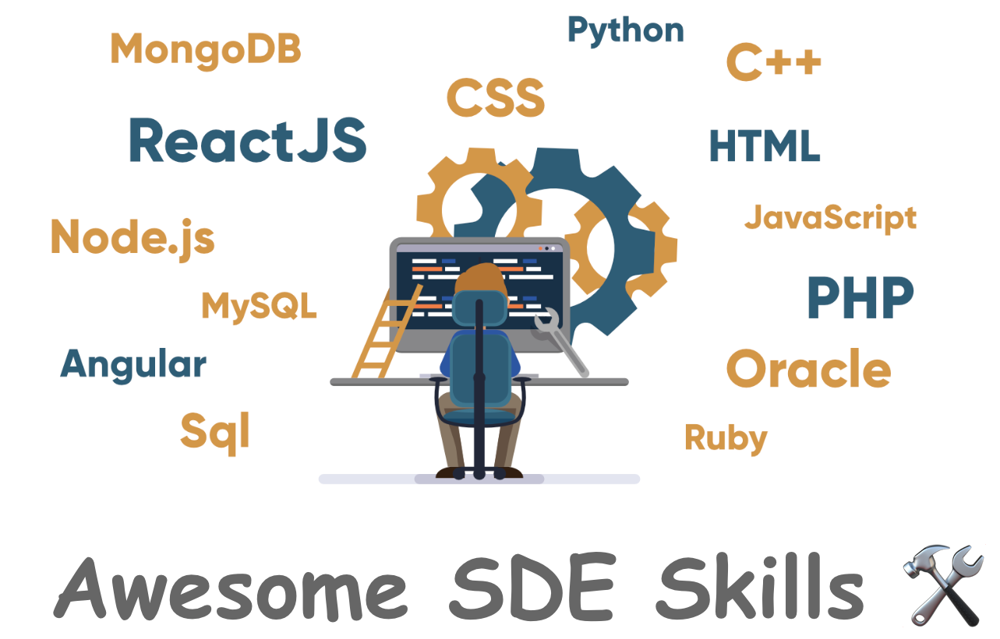
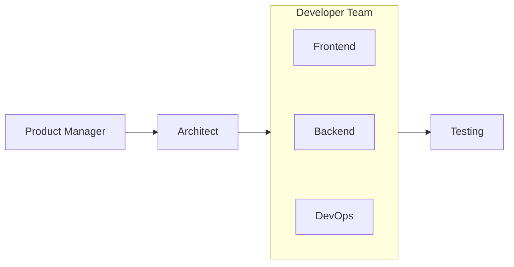

<h1 align="center">Awesome SDE Skills</h1>

<p align="center">
  
</p>

<p align="center">
  <a href="https://awesome.re">
    
  </a>
  <a href="https://makeapullrequest.com">
    
  </a>
</p>

Welcome to the Awesome SDE Skills Repo! This repository is a curated collection
of essential software development skills and best practices designed for one
primary purpose: rapid prototyping and efficient project kickstarts.

## Quickstart
### Installation
1. Copy the desired skill folder (e.g., `$(pwd)/Architect`) into
   `$CODEX_HOME/skills/` (defaults to `~/.codex/skills/`).
2. Restart Codex so it loads the new skill.
3. In your next session, invoke skill with `$`. For example `$architect` to
   concretize the plan.


### What are SKILLs and how are they different from MCP tools?
Skills are specialized instruction sets that guides the LLM on how to 
accomplish SPECIFIC tasks. You can think of skills as a playbook with 
concrete inputs and outputs. Skills usually contains the follows:
1. Step-by-step workflows and procedures. More concrete the workflow 
and procedures are, the more likely this skill will yield good results
2. Code examples and templates. A good example workflow can significantly 
increase the possibility of success.
3. Standards, formatting guidelines, pitfalls
4. References and code snippets

MCPs are tools with which LLM interacts with external systems and services. 
They are actually callable *functions*, no matter whether they are real 
functions or another LLM call (prompt + response)

MCP tools extends the **capability** of LLM (what can be done)
SKILLs extend the **expertise** of LLM (how to do a specific task)

## Contents
- [Relation among SKILLs](#relation-among-skills)
- [Skills](#skills)
  - [Different Roles](#different-roles)
  - [Common Development Skills](#common-development-skills)
- [Creating Skills](#creating-skills)
- [Contributing](#contributing)

## Relation among SKILLs


## Skills:
### Role-based:
- [Product Manager](./PM/): Turn user prompt into a high level **PLAN.md** 
- [Architect](./Architect/): Turn **PLAN.md** to concrete implementation ready **DESIGN.md** 
- [Frontend Developer](./Developer/Frontend): Take one frontend implementation task from **DESIGN.md** and record it in **IMPL.md**. Default platform is web and macOS.
- [Backend Developer](./Developer/Backend): Take one backend implementation task from **DESIGN.md** and record it in **IMPL.md**. Default Language is `rust`
- [DevOps Developer](./Developer/DevOps): Take one DevOps implemenation task from **DESIGN.md** and record it in **IMPL.md**.
### Common Development Skills:
- [git-commit](./Common/git-commit/): Generate a well-formatted git commit
- [pr-drafting](./Common/pr-drafting/): Generate a well-documented pull request with description
- [pr-reviewing](./Common/pr-reviewing/): Review a pull request with detailed feedback

## Creating Skills
### Skill Structure

Each skill is a folder containing a `SKILL.md` file with YAML frontmatter:

```
skill-name/
├── SKILL.md          # Required: Skill instructions and metadata
├── scripts/          # Optional: Helper scripts
├── templates/        # Optional: Document templates
└── resources/        # Optional: Reference files
```

### Basic Skill Template

```markdown
---
name: my-skill-name
description: A clear description of what this skill does and when to use it.
---

# My Skill Name

Detailed description of the skill's purpose and capabilities.

## When to Use This Skill

- Use case 1
- Use case 2
- Use case 3

## Instructions

[Detailed instructions for Claude on how to execute this skill]

## Examples

[Real-world examples showing the skill in action]
```


## Contributing
PRs and feedbacks are welcome as together we can incorporate more real software
engineering practice for the skills. When adding new skills, follow the [skill
template](#basic-skill-template) above, make sure the `description` clearly
states when the skills should be triggered and test that metadata within context
window limits. 